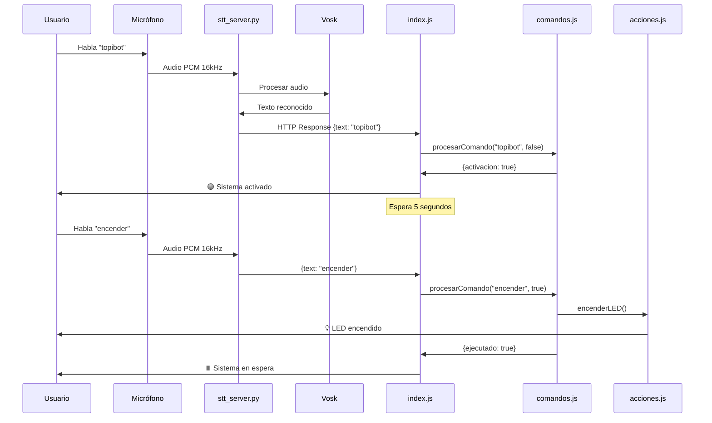

# 📖 Guía Completa - TopiBot

## Tabla de Contenidos

1. [Descripción del Sistema](#descripción-del-sistema)
2. [Arquitectura Técnica](#arquitectura-técnica)
3. [Requisitos del Sistema](#requisitos-del-sistema)
4. [Instalación Detallada](#instalación-detallada)
5. [Uso y Comandos](#uso-y-comandos)
6. [Configuración Avanzada](#configuración-avanzada)
7. [Desarrollo y Extensión](#desarrollo-y-extensión)
8. [Troubleshooting](#troubleshooting)
9. [Optimización y Rendimiento](#optimización-y-rendimiento)

---

## Descripción del Sistema

TopiBot es un sistema de reconocimiento de voz completamente **offline** para Raspberry Pi que utiliza:
- **Vosk**: Motor de reconocimiento de voz de código abierto
- **Python/Flask**: Servidor HTTP para el procesamiento de audio
- **Node.js**: Lógica de comandos y gestión de acciones

### ¿Cómo funciona?

```
1. Usuario habla al micrófono
   ↓
2. Python captura audio y usa Vosk para transcribir
   ↓
3. Envía texto reconocido a Node.js vía HTTP
   ↓
4. Node.js detecta palabra de activación "topibot"
   ↓
5. Si está activo, procesa el comando
   ↓
6. Ejecuta la acción correspondiente
```

### Ventajas de esta arquitectura

- ✅ **Separación de responsabilidades**: Python para STT pesado, Node.js para lógica ligera
- ✅ **Bajo consumo**: ~300 MB RAM total en lugar de >600 MB
- ✅ **Extensible**: Fácil añadir comandos sin tocar el reconocimiento de voz
- ✅ **Mantenible**: Código Python y Node.js independientes

---

## Arquitectura Técnica

### Componentes del Sistema

```
┌─────────────────────────────────────────────────────────────┐
│                         RASPBERRY PI                         │
├─────────────────────────────────────────────────────────────┤
│                                                               │
│  ┌──────────────┐         ┌─────────────────────────────┐  │
│  │  Micrófono   │ Audio   │   stt_server.py             │  │
│  │  (USB/ALSA)  │────────>│   - Vosk Model              │  │
│  └──────────────┘         │   - Flask HTTP Server       │  │
│                            │   - Port 5005               │  │
│                            │   - Transcribe audio        │  │
│                            └─────────────┬───────────────┘  │
│                                          │ HTTP GET         │
│                                          │ {text: "..."}    │
│                            ┌─────────────┴───────────────┐  │
│                            │   index.js                  │  │
│                            │   - Axios HTTP Client       │  │
│                            │   - Palabra de activación   │  │
│                            │   - Timeout 5 segundos      │  │
│                            └─────────────┬───────────────┘  │
│                                          │                  │
│                            ┌─────────────┴───────────────┐  │
│                            │   comandos.js               │  │
│                            │   - Mapeo keywords→actions  │  │
│                            │   - procesarComando()       │  │
│                            └─────────────┬───────────────┘  │
│                                          │                  │
│                            ┌─────────────┴───────────────┐  │
│                            │   acciones.js               │  │
│                            │   - Funciones específicas   │  │
│                            │   - Control de hardware     │  │
│                            └─────────────────────────────┘  │
│                                                               │
└─────────────────────────────────────────────────────────────┘
```

### Flujo de Datos



---

## Requisitos del Sistema

### Hardware

| Componente | Mínimo | Recomendado |
|------------|---------|-------------|
| Raspberry Pi | 3 B+ (1GB RAM) | 4 (2GB+ RAM) |
| Micrófono | USB básico | USB con cancelación de ruido |
| Tarjeta SD | 8 GB | 16 GB+ |
| Alimentación | 2.5A | 3A |

### Software

| Software | Versión Mínima | Notas |
|----------|----------------|-------|
| Raspberry Pi OS | Bullseye | Bookworm también compatible |
| Python | 3.7 | 3.9+ recomendado |
| Node.js | 16.0.0 | 18.x LTS recomendado |
| pip | 20.0 | Para instalar paquetes Python |
| npm | 8.0 | Incluido con Node.js |

### Dependencias Python

```bash
# Instaladas en virtual environment
vosk >= 0.3.45
sounddevice >= 0.4.6
flask >= 2.0.0
```

**Nota**: Las dependencias Python se instalan en un virtual environment (`venv/`) para evitar conflictos con paquetes del sistema.

### Dependencias Node.js

```bash
axios >= 0.27.2
```

---

## Instalación Detallada

### Método 1: Instalación Automática (Recomendado)

#### Paso 1: Clonar repositorio

```bash
# Conectar por SSH a tu Raspberry Pi
ssh pi@<IP_RASPBERRY>

# Clonar el proyecto
cd ~
git clone <URL_REPOSITORIO> topibot
cd topibot
```

#### Paso 2: Ejecutar instalador

```bash
chmod +x install.sh
./install.sh
```

El script realizará automáticamente:
1. ✅ Verificación de Node.js y Python
2. ✅ Instalación de dependencias del sistema (portaudio, alsa-utils)
3. ✅ Instalación de paquetes Python
4. ✅ Instalación de paquetes Node.js
5. ✅ Descarga del modelo Vosk español (43 MB)
6. ✅ Configuración de servicios systemd
7. ✅ Inicio de servicios (opcional)

#### Paso 3: Verificar instalación

```bash
./verificar.sh
```

Deberías ver algo como:
```
✅ Node.js v18.19.0 - Compatible
✅ Python 3.9.2 - Disponible
✅ vosk instalado
✅ sounddevice instalado
✅ flask instalado
✅ axios instalado
✅ Modelo Vosk instalado en model/
...
```

### Método 2: Instalación Manual

#### Paso 1: Preparar el sistema

```bash
# Actualizar sistema
sudo apt update && sudo apt upgrade -y

# Instalar dependencias del sistema
sudo apt install -y portaudio19-dev python3-dev alsa-utils git
```

#### Paso 2: Instalar Node.js 18 (si no está instalado)

```bash
# Descargar e instalar Node.js 18
curl -fsSL https://deb.nodesource.com/setup_18.x | sudo -E bash -
sudo apt install -y nodejs

# Verificar instalación
node -v   # Debe mostrar v18.x.x
npm -v    # Debe mostrar 9.x.x o superior
```

#### Paso 3: Crear virtual environment e instalar dependencias Python

```bash
cd ~/topibot

# Crear virtual environment
python3 -m venv venv

# Activar virtual environment
source venv/bin/activate

# Actualizar pip
pip install --upgrade pip

# Instalar paquetes necesarios
pip install vosk sounddevice flask

# Desactivar (opcional)
deactivate
```

**Importante**: El virtual environment evita conflictos con paquetes del sistema (PEP 668).

#### Paso 4: Instalar dependencias Node.js

```bash
cd ~/topibot
npm install
```

#### Paso 5: Descargar modelo Vosk

```bash
cd ~/topibot

# Descargar modelo español pequeño (43 MB)
wget https://alphacephei.com/vosk/models/vosk-model-small-es-0.42.zip

# Descomprimir
unzip vosk-model-small-es-0.42.zip

# Mover a directorio model/
mv vosk-model-small-es-0.42/* model/

# Limpiar
rm -rf vosk-model-small-es-0.42*
```

#### Paso 6: Configurar servicios systemd

```bash
# Copiar archivos de servicio
sudo cp stt.service /etc/systemd/system/
sudo cp topibot.service /etc/systemd/system/

# Recargar systemd
sudo systemctl daemon-reload

# Habilitar servicios (inicio automático)
sudo systemctl enable stt.service
sudo systemctl enable topibot.service

# Iniciar servicios
sudo systemctl start stt.service
sleep 3
sudo systemctl start topibot.service
```

#### Paso 7: Verificar funcionamiento

```bash
# Ver estado de servicios
sudo systemctl status stt.service
sudo systemctl status topibot.service

# Ver logs en tiempo real
sudo journalctl -u topibot.service -f
```

---

## Uso y Comandos

### Flujo de Uso Básico

1. **Activar el sistema**: Di "**topibot**"
2. **Esperar confirmación**: Verás "🟢 Sistema activado"
3. **Dar comando**: Di tu comando (ej: "encender")
4. **Ver resultado**: La acción se ejecuta
5. **Repetir**: El sistema vuelve a espera automáticamente

### Comandos Disponibles

#### LED (4 comandos)

| Comando | Palabras clave | Acción |
|---------|---------------|--------|
| Encender | encender, enciende, prende, prender | Enciende el LED |
| Apagar | apagar, apaga | Apaga el LED |
| Estado | estado, cómo está, como esta | Muestra estado actual |
| Alternar | alternar, cambiar, toggle | Cambia el estado |

#### Información (3 comandos)

| Comando | Palabras clave | Acción |
|---------|---------------|--------|
| Saludar | hola, buenos días, buenas tardes, buenas noches | Saluda al usuario |
| Hora | hora, qué hora es, que hora es | Dice la hora actual |
| Fecha | fecha, qué día es, que dia es | Dice la fecha actual |

#### Sistema (2 comandos)

| Comando | Palabras clave | Acción |
|---------|---------------|--------|
| Info | información, informacion, sistema | Muestra info del sistema |
| Reiniciar | reiniciar, reset | Reinicia el estado |

### Ejemplo de Sesión Completa

```
[Sistema iniciado, en espera]

Usuario: "topibot"
Sistema: 👂 Escuchado: topibot
         🎯 ¡Palabra de activación detectada! Sistema activo...
         🟢 Sistema activado - Escuchando comando...

Usuario: "encender"
Sistema: 👂 Escuchado: encender
         💡 LED encendido
         ✅ Comando ejecutado
         ⏸️  Sistema en espera - Di 'topibot' para activar

[Pasan 10 segundos]

Usuario: "topibot"
Sistema: 🟢 Sistema activado - Escuchando comando...

Usuario: "qué hora es"
Sistema: 👂 Escuchado: qué hora es
         🕐 La hora es: 14:30:25
         ✅ Comando ejecutado
         ⏸️  Sistema en espera - Di 'topibot' para activar

Usuario: "topibot"
Sistema: 🟢 Sistema activado - Escuchando comando...

[Pasan 5 segundos sin hablar]

Sistema: ⏸️  Sistema en espera - Di 'topibot' para activar
```

---

## Configuración Avanzada

### Cambiar Palabra de Activación

Edita `comandos.js`:

```javascript
// Línea 26
export const PALABRA_ACTIVACION = "jarvis";  // O la palabra que quieras
```

**Nota**: Elige palabras que:
- Sean fáciles de pronunciar
- No sean muy comunes en conversaciones normales
- Tengan al menos 2-3 sílabas

### Cambiar Tiempo de Escucha Activa

Edita `comandos.js`:

```javascript
// Línea 32
export const TIEMPO_ESCUCHA_ACTIVA = 10000;  // 10 segundos en lugar de 5
```

### Ajustar Micrófono

```bash
# Listar dispositivos de audio
arecord -l

# Abrir mezclador de audio
alsamixer

# Presiona F4 para modo captura
# Usa flechas para ajustar volumen
# ESC para salir
```

### Configurar Dispositivo de Audio por Defecto

```bash
# Crear/editar archivo de configuración ALSA
nano ~/.asoundrc

# Añadir (reemplaza X con tu número de tarjeta de arecord -l):
defaults.pcm.card X
defaults.ctl.card X
```

### Cambiar Puerto del Servidor STT

Edita `stt_server.py`:

```python
# Línea 37
app.run(host="0.0.0.0", port=5005, debug=False)  # Cambia 5005
```

Y también en `index.js`:

```javascript
// Línea 17
const STT_SERVER_URL = "http://localhost:5005/listen";  // Cambia el puerto
```

---

## Desarrollo y Extensión

### Añadir un Nuevo Comando

#### Ejemplo: Comando para decir un chiste

**Paso 1**: Crear función en `acciones.js`

```javascript
/**
 * Dice un chiste aleatorio
 */
export function decirChiste() {
  const chistes = [
    "¿Por qué los programadores prefieren el modo oscuro? Porque la luz atrae bugs.",
    "¿Cuál es el animal más antiguo? La cebra, porque está en blanco y negro.",
    "¿Qué le dice un bit al otro? Nos vemos en el bus."
  ];
  
  const chisteAleatorio = chistes[Math.floor(Math.random() * chistes.length)];
  console.log("😂 " + chisteAleatorio);
}
```

**Paso 2**: Importar en `comandos.js`

```javascript
// Al inicio del archivo, añadir a las importaciones:
import {
  // ... otras funciones
  decirChiste,  // ← Nueva función
} from "./acciones.js";
```

**Paso 3**: Añadir al array de comandos en `comandos.js`

```javascript
// Dentro del array 'comandos':
{
  keywords: ["chiste", "cuéntame un chiste", "hazme reír"],
  action: decirChiste,
  description: "Cuenta un chiste"
},
```

**Paso 4**: Reiniciar el servicio

```bash
sudo systemctl restart topibot.service
```

**Paso 5**: Probar

```
Usuario: "topibot"
Sistema: 🟢 Sistema activado

Usuario: "chiste"
Sistema: 😂 ¿Por qué los programadores prefieren el modo oscuro?...
```

### Integrar con GPIO (Hardware)

Ejemplo para controlar un LED físico:

```javascript
// acciones.js
import { Gpio } from 'onoff';  // npm install onoff

const led = new Gpio(17, 'out');  // GPIO 17

export function encenderLED() {
  led.writeSync(1);  // HIGH
  console.log("💡 LED físico encendido");
}

export function apagarLED() {
  led.writeSync(0);  // LOW
  console.log("🔴 LED físico apagado");
}
```

### Ejecutar Comandos del Sistema

```javascript
// acciones.js
import { exec } from 'child_process';
import { promisify } from 'util';

const execPromise = promisify(exec);

export async function reiniciarRaspberry() {
  console.log("🔄 Reiniciando Raspberry Pi en 5 segundos...");
  await execPromise('sleep 5 && sudo reboot');
}

export async function leerTemperatura() {
  try {
    const { stdout } = await execPromise('vcgencmd measure_temp');
    const temp = stdout.match(/temp=([\d.]+)/)[1];
    console.log(`🌡️  Temperatura CPU: ${temp}°C`);
  } catch (error) {
    console.error("Error leyendo temperatura:", error);
  }
}
```

---

## Troubleshooting

### Problema: "Servidor STT no está ejecutándose"

**Síntomas**: Node.js muestra error de conexión

**Solución**:
```bash
# Verificar estado del servicio
sudo systemctl status stt.service

# Si está detenido, iniciarlo
sudo systemctl start stt.service

# Ver logs para diagnóstico
sudo journalctl -u stt.service -n 50
```

### Problema: "No se encuentra el modelo"

**Síntomas**: Error al iniciar `stt_server.py`

**Solución**:
```bash
# Verificar que el modelo existe
ls -la ~/topibot/model/

# Debe contener: am/, conf/, graph/, ivector/
# Si está vacío, descargar modelo:
cd ~/topibot
wget https://alphacephei.com/vosk/models/vosk-model-small-es-0.42.zip
unzip vosk-model-small-es-0.42.zip
mv vosk-model-small-es-0.42/* model/
rm -rf vosk-model-small-es-0.42*
```

### Problema: "No se detecta el micrófono"

**Síntomas**: Error de sounddevice o no captura audio

**Solución**:
```bash
# Listar dispositivos
arecord -l

# Debe mostrar tu micrófono
# Si no aparece, reconectar USB o verificar hardware

# Probar grabación
arecord -d 3 -f cd test.wav
aplay test.wav

# Si escuchas tu voz, el micrófono funciona
```

### Problema: "Palabra de activación no se reconoce"

**Causas comunes**:
1. Volumen de micrófono muy bajo
2. Ruido ambiental alto
3. Pronunciación poco clara
4. Modelo Vosk no apropiado para tu acento

**Soluciones**:
```bash
# Ajustar volumen
alsamixer  # F4, ajustar con flechas

# Ver lo que reconoce en tiempo real
sudo journalctl -u stt.service -f

# Habla y verás el texto reconocido
# Si reconoce mal "topibot", prueba cambiar la palabra
```

### Problema: "Sistema lento o se congela"

**Causas**:
- RAM insuficiente
- CPU sobrecargada
- Modelo Vosk demasiado grande

**Soluciones**:
```bash
# Verificar memoria
free -h

# Si tienes <100 MB libre, aumentar swap:
sudo dphys-swapfile swapoff
sudo nano /etc/dphys-swapfile
# Cambiar CONF_SWAPSIZE=2048
sudo dphys-swapfile setup
sudo dphys-swapfile swapon

# Verificar CPU
top

# Cerrar procesos innecesarios
sudo systemctl stop bluetooth
sudo systemctl disable bluetooth
```

### Problema: "Comandos no se ejecutan"

**Diagnóstico**:
```bash
# Ver logs de Node.js
sudo journalctl -u topibot.service -f

# Prueba manual
cd ~/topibot
node index.js

# Di comandos y ve qué pasa en la consola
```

**Verificaciones**:
1. ¿Se detecta la palabra de activación? → Debe mostrar "🟢 Sistema activado"
2. ¿Se escucha el comando? → Debe mostrar "👂 Escuchado: [comando]"
3. ¿Se reconoce el comando? → Verifica que la keyword esté en `comandos.js`

---

## Optimización y Rendimiento

### Benchmarks Raspberry Pi 3 B+

| Métrica | Valor Típico | Óptimo |
|---------|--------------|--------|
| Tiempo arranque modelo | 10-15 seg | 5-8 seg (RPi 4) |
| Latencia reconocimiento | 2-3 seg | 1-2 seg |
| RAM usada (total) | 450-550 MB | 400-500 MB |
| CPU (escuchando) | 30-50% | 20-40% |
| CPU (idle) | 15-25% | 10-20% |

### Tips de Optimización

#### 1. Usar modelo más pequeño

Si la precisión no es crítica:
```bash
# Modelo micro (13 MB) - muy rápido pero menos preciso
wget https://alphacephei.com/vosk/models/vosk-model-small-es-0.42.zip
```

#### 2. Overclock moderado (con precaución)

```bash
sudo nano /boot/config.txt

# Añadir:
arm_freq=1400  # RPi 3 B+ default es 1200
over_voltage=2

# Reiniciar
sudo reboot
```

⚠️ **Advertencia**: Requiere refrigeración adecuada y puede reducir vida útil.

#### 3. Deshabilitar servicios innecesarios

```bash
# Bluetooth (si no lo usas)
sudo systemctl disable bluetooth

# GUI (si solo usas SSH)
sudo systemctl set-default multi-user.target
```

#### 4. Optimizar configuración de audio

En `stt_server.py`, ajustar tamaño de buffer:

```python
# Línea 21
with sd.RawInputStream(
    samplerate=16000,
    blocksize=4000,  # Reducir de 8000 a 4000 para menor latencia
    dtype="int16",
    channels=1,
    callback=callback,
):
```

#### 5. Usar tarjeta SD rápida

- Clase 10 mínimo
- UHS-I (U3) recomendado
- Ayuda con lectura del modelo Vosk

### Monitoreo de Recursos

Script para monitorear:

```bash
#!/bin/bash
# monitor.sh

while true; do
    clear
    echo "=== TopiBot System Monitor ==="
    echo ""
    
    echo "CPU Usage:"
    top -bn1 | grep "Cpu(s)" | awk '{print $2}' | cut -d'%' -f1
    
    echo ""
    echo "Memory:"
    free -h | grep Mem
    
    echo ""
    echo "STT Service:"
    systemctl is-active stt.service
    
    echo ""
    echo "TopiBot Service:"
    systemctl is-active topibot.service
    
    echo ""
    echo "Processes:"
    ps aux | grep -E "python3.*stt_server|node.*index.js" | grep -v grep
    
    sleep 2
done
```

---

## Preguntas Frecuentes (FAQ)

### ¿Funciona sin internet?

Sí, completamente offline. Todo el procesamiento se hace localmente.

### ¿Puedo usar otro idioma?

Sí, descarga otro modelo de [Vosk Models](https://alphacephei.com/vosk/models) y reemplaza el directorio `model/`.

### ¿Funciona en Raspberry Pi Zero?

Técnicamente sí, pero será muy lento. Recomendado mínimo RPi 3.

### ¿Puedo controlar dispositivos IoT?

Sí, añade funciones en `acciones.js` que interactúen con APIs de tus dispositivos.

### ¿Funciona con múltiples usuarios?

El sistema no diferencia voces, responde a cualquiera que hable.

### ¿Puedo cambiar la voz de respuesta?

El sistema imprime texto, no habla. Para síntesis de voz (TTS), puedes integrar `espeak` o `pyttsx3`.

---

**Documentación creada para TopiBot v1.0.0**  
Última actualización: Diciembre 2025
